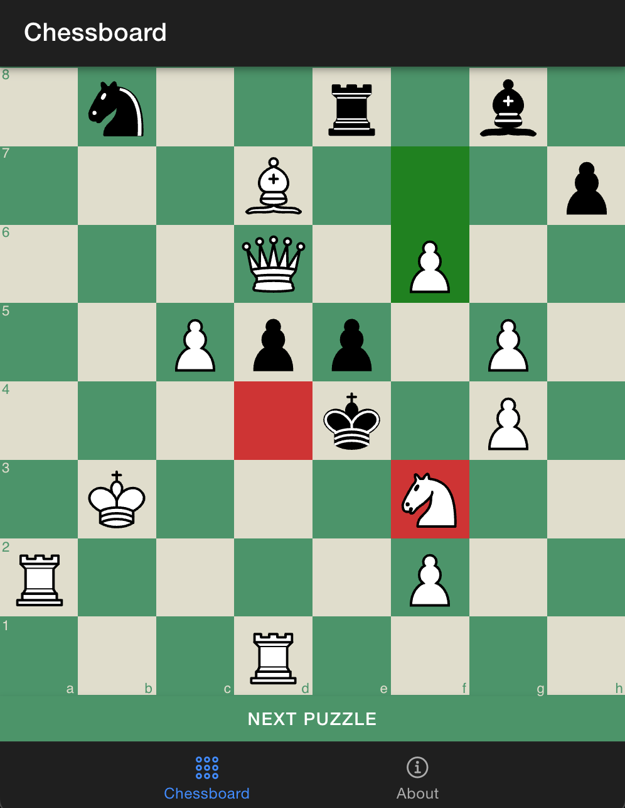

# Chess Puzzles App

Ionic App to generate and solve Chess Puzzles. Start by running the app and clicking `NEXT PUZZLE`. Now a puzzle is generated and you can solve it by dragging a piece on another position. If you're wrong, green fields are indicating the correct move. You were right if only green marked fields are shoing up. Currently it's always whites turn. Click `NEXT PUZZLE` to generate a new puzzle after solving one.

## Requirements

- npm
- Ionic

## Setup

1. Clone this repo
2. Run `npm install`
3. Run `ionic serve`

## Usage

You should see a local address after running `ionic serve` in your console output. Open this address in your browser to solve some puzzles!

## License

This project is licensed under the GPLv3 license since it's using some libraries under the GPLv3 license.

## Libraries

The following libraries are awesome and used by this project.

- [gchessboard](https://mganjoo.github.io/gchessboard/)
- [chess.js](https://github.com/jhlywa/chess.js)
- [stockfish.js](https://github.com/nmrugg/stockfish.js)
- [432k-chess-puzzles](https://github.com/rebeccaloran/432k-chess-puzzles)

## Disclaimer

This is not made for production use. Please don't distribute without major changes.